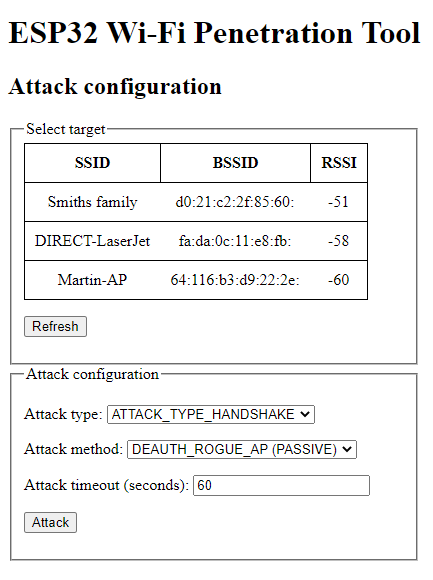
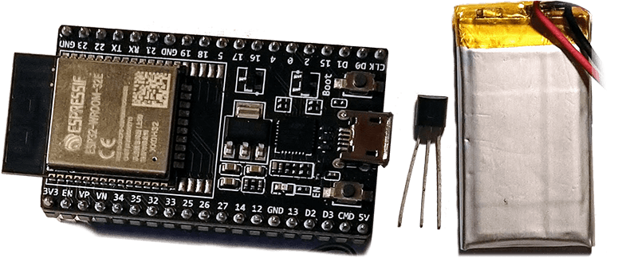

# ESP32 Wi-Fi Penetration Tool

<p align="center">
    
</p>

<p align="center">
    
</p>

This project introduces an universal tool for ESP32 platform for implementing various Wi-Fi attacks. It provides some common functionality that is commonly used in Wi-Fi attacks and makes implementing new attacks a bit simpler. It also includes Wi-Fi attacks itself like capturing PMKIDs from handshakes, or handshakes themselves by different methods like starting rogue duplicated AP or sending deauthentication frames directly, etc...

Obviously cracking is not part of this project, as ESP32 is not sufficient to crack hashes in effective way. The rest can be done on this small, cheap, low-power SoC.

## Table of Contents
- [Features](#features)
- [Demo Video](#demo-video)
- [Usage](#usage)
- [Build and Flash](#build-and-flash)
- [Documentation](#documentation)
- [Hardware](#hardware)
- [Similar projects](#similar-projects)
- [Contributing](#contributing)
- [Disclaimer](#disclaimer)
- [License](#license)

## Features
- **PMKID capture**
- **WPA/WPA2 handshake capture** and parsing
- **Deauthentication attacks** using various methods
- **Denial of Service attacks**
- Formatting captured traffic into **PCAP format**
- Parsing captured handshakes into **HCCAPX file** ready to be cracked by Hashcat
- Passive handshake sniffing
- Easily extensible framework for new attacks implementations
- Management AP for easy configuration on the go using smartphone for example
- And more...

### Demo video
[](https://www.youtube.com/watch?v=9I3BxRu86GE)


## Usage
1. [Build and Flash](#build-and-flash) the project onto your ESP32 board.
2. Power the ESP32.
3. The management AP is started automatically after boot.
4. Connect to this AP. By default:
   - **SSID:** `ManagementAP`
   - **Password:** `mgmtadmin`
5. In your browser, open `192.168.4.1`. You should see a web client to configure and control the tool.

    

## Build and Flash
This project is built using **PlatformIO**. Make sure you have [PlatformIO Core](https://platformio.org/install/cli) installed.

### Build
To build the project, run the following command in your terminal:
```shell
platformio run
```

### Flash
To build and flash the project to your device, run the following command. Replace `/dev/ttyUSB0` with the correct serial port for your device.
```shell
platformio run --target upload --upload-port /dev/ttyUSB0
```

## Documentation
### Wi-Fi attacks
Attacks implementations in this project are described in [main component README](main/). Theory behind these attacks is located in [doc/ATTACKS_THEORY.md](doc/ATTACKS_THEORY.md)
### API reference
This project uses Doxygen notation for documenting components API and implementation. Doxyfile is included so if you want to generate API reference, just run `doxygen` from root directory. It will generate HTML API reference into `doc/api/html`.

### Components
This project consists of multiple components, that can be reused in other projects. Each component has it's own README with detailed description. Here comes brief description of components:

- [**Main**](main) component is entry point for this project. All neccessary initialisation steps are done here. Management AP is started and the control is handed to webserver.
- [**Wifi Controller**](components/wifi_controller) component wraps all Wi-Fi related operations. It's used to start AP, connect as STA, scan nearby APs etc. 
- [**Webserver**](components/webserver) component provides web UI to configure attacks. It expects that AP is started and no additional security features like SSL encryption are enabled.
- [**Wi-Fi Stack Libraries Bypasser**](components/wsl_bypasser) component bypasses Wi-Fi Stack Libraries restriction to send some types of arbitrary 802.11 frames.
- [**Frame Analyzer**](components/frame_analyzer) component processes captured frames and provides parsing functionality to other components.
- [**PCAP Serializer**](components/pcap_serializer) component serializes captured frames into PCAP binary format and provides it to other components (mostly for webserver/UI)
- [**HCCAPX Serializer**](components/hccapx_serializer) component serializes captured frames into HCCAPX binary format and provides it to other components (mostly for webserver/UI)

### Further reading
* [Academic paper about this project (PDF)](https://excel.fit.vutbr.cz/submissions/2021/048/48.pdf)

## Hardware 
This project was mostly build and tested on **ESP32-DEVKITC-32E**
but there should not be any differences for any **ESP32-WROOM-32** modules.

<p align="center">
    
</p>

On the following pictures you can see a battery (Li-Pol accumulator) powered ESP32 DevKitC using following hardware:
- **ESP32-DEVKITC-32E** (cost 213 CZK/8.2 EUR/9.6 USD)
- 220mAh Li-Pol 3.7V accumulator (weights ±5g, cost 77 CZK/3 EUR/3.5 USD)
- MCP1702-3302ET step-down 3.3V voltage regulator (cost 11 CZK/0.42 EUR/0.50 USD)
- Czech 5-koruna coin for scale (weights 4.8g, diameter 23 mm, cost 0.19 EUR/0.23 USD)
<p align="center">
    
    
</p>

Altogether (without coin) this setup weights around 17g. This can be further downsized by using smaller Li-Pol accumulator and using ESP32-WROOM-32 modul directly instead of whole dev board.

This setup cost me around 300 CZK (± 11.50 EUR/13.50 USD). Using the modul directly that costs around 80 CZK (± 3 EUR/3.5 USD) we can get to price of 160 CZK (± 6.5 EUR/7.5 USD) which makes this tool really cheap and available to almost everybody.

### Power consumption
Based on experimental measurements, ESP32 consumes around 100mA during attack executions. 

## Similar projects
* [GANESH-ICMC/esp32-deauther](https://github.com/GANESH-ICMC/esp32-deauther)
* [SpacehuhnTech/esp8266_deauther](https://github.com/SpacehuhnTech/esp8266_deauther)
* [justcallmekoko/ESP32Marauder](https://github.com/justcallmekoko/ESP32Marauder)
* [EParisot/esp32-network-toolbox](https://www.tindie.com/products/klhnikov/esp32-network-toolbox/)
* [Jeija/esp32free80211](https://github.com/Jeija/esp32free80211)

## Contributing
Feel free to contribute. Don't hestitate to refactor current code base. Please stick to Doxygen notation when commenting new functions and files. This project is mainly build for educational and demonstration purposes, so verbose documentation is welcome.

## Disclaimer
This project demonstrates vulnerabilities of Wi-Fi networks and its underlaying 802.11 standard and how ESP32 platform can be utilised to attack on those vulnerable spots. Use responsibly against networks you have permission to attack on.

## License
Even though this project is licensed under MIT license (see [LICENSE](LICENSE) file for details), don't be shy or greedy and share your work.